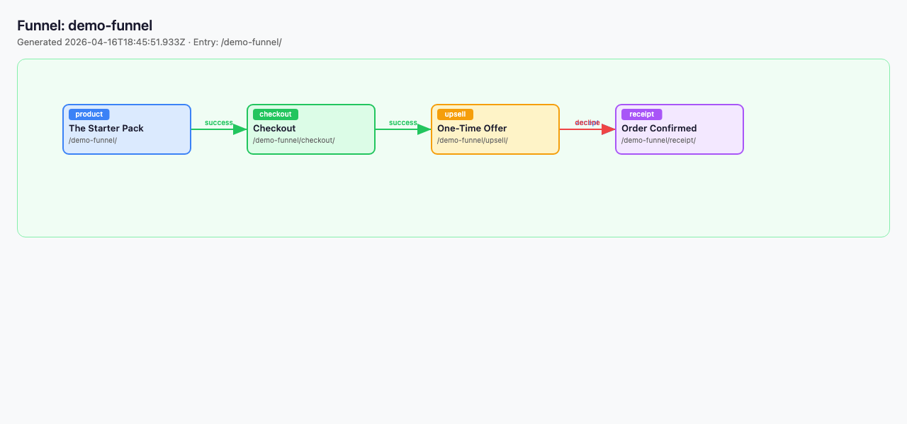
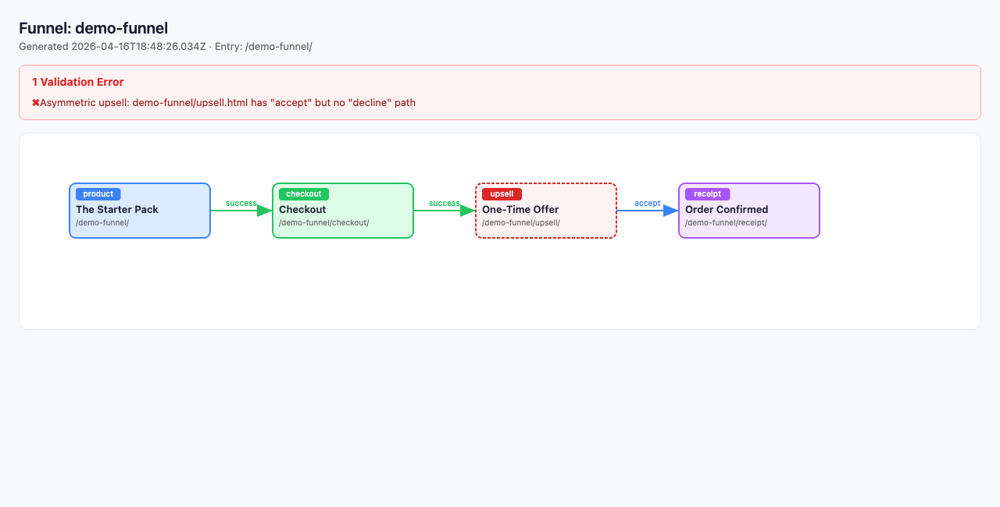

# Funnel Map

Every time you run `npm run build`, Campaign Page Kit reads the routing frontmatter on each page, builds a directed graph of your campaign, validates it against six structural rules, and writes a self-contained HTML visualization to `.cpk/{slug}/funnel.html`. Open it in a browser to see exactly how your customer moves from entry page to receipt.

The funnel map is developer-only. It never ships to production — `.cpk/` is gitignored.



## Quick start

1. Add routing frontmatter to your pages (see [Frontmatter fields](#frontmatter-fields-that-drive-the-graph) below):
   ```yaml
   ---
   page_type: product
   next_success_url: /summer-sale/checkout/
   ---
   ```
2. Run a build:
   ```bash
   npm run build
   ```
3. Open the visualization:
   ```bash
   open .cpk/summer-sale/funnel.html
   ```

If the build fails with funnel validation errors, the error message tells you which page and which rule. Scroll down to [The 6 validation rules](#the-6-validation-rules) for fixes.

## Frontmatter fields that drive the graph

Four fields on each page template define the funnel:

| Field | Values | What it does |
|-------|--------|--------------|
| `page_type` | `product`, `checkout`, `upsell`, `receipt` | Node type. Color-codes the page in the visual and drives validation (upsells must have both accept and decline; a funnel must have at least one receipt). |
| `next_success_url` | Campaign-relative URL | Creates a **success** edge from this page to the target. Used on product and checkout pages. |
| `next_upsell_accept` | Campaign-relative URL | Creates an **accept** edge. Used on upsell pages. |
| `next_upsell_decline` | Campaign-relative URL | Creates a **decline** edge. Used on upsell pages. |

Only campaign-relative URLs become graph edges. External URLs (`https://...`), protocol-relative URLs (`//...`), and other schemes (`mailto:`, `tel:`, etc.) are deliberately ignored — they're assumed to exit your campaign. Query strings and fragments are stripped before resolution, so `/sale/receipt/?src=upsell` resolves to the same node as `/sale/receipt/`.

## Running the build

```bash
npm run build                  # strict — funnel errors exit non-zero
npm run build -- --lenient     # downgrade funnel errors to warnings
npm run dev                    # lenient by default
npm run dev -- --strict        # opt into strict validation during dev
```

Strict mode is the right default for CI. Lenient mode is useful while you're mid-refactor and some routing is intentionally half-wired.

The funnel visual (`funnel.html`) regenerates on every full build. Partial rebuilds (dev server file watches) skip regeneration on purpose — a partial build only touches one page, so the graph would be incomplete. The dev server runs a full build on startup, so the visual is always current when you open it.

## The 6 validation rules

### 1. Broken link

**What it catches.** A `next_*_url` field points to a page that doesn't exist in the campaign.

**Error:**
```
Funnel [sale]: Broken link: sale/checkout.html has success edge to "upgrade" which does not exist
```

**Fix.** Either create the missing page (`sale/upgrade.html`) or update the URL. Typos in URLs are the #1 source of this error.

### 2. Orphan page

**What it catches.** A page exists in the campaign but nothing points to it — it's unreachable by walking from the index page.

**Error:**
```
Funnel [sale]: Orphan page: sale/bonus.html is not reachable from the entry point
```

**Fix.** Add a `next_success_url`, `next_upsell_accept`, or `next_upsell_decline` on an upstream page that points to the orphan. If the page really is intentionally disconnected (e.g., a standalone FAQ), either delete it or link it from an upstream page.

### 3. Missing terminal

**What it catches.** A typed page (`product`, `checkout`, `upsell`) has no path to any `receipt` page. This catches both dead ends (no outgoing edges) and cycles that never reach a receipt (e.g., checkout → upsell → checkout).

**Error:**
```
Funnel [sale]: Missing terminal: sale/checkout.html (type: checkout) has no path to a receipt page
```

Or, when the campaign has no receipt at all:
```
Funnel [sale]: Missing terminal: campaign "sale" has no receipt page
```

**Fix.** Make sure at least one page has `page_type: receipt`, and that every funnel path eventually reaches it.

### 4. Asymmetric upsell

**What it catches.** An upsell page has `next_upsell_accept` but no `next_upsell_decline`, or vice versa. Users must always have both paths — what happens when they click "no thanks"?

**Error:**
```
Funnel [sale]: Asymmetric upsell: sale/upsell.html has "accept" but no "decline" path
```

**Fix.** Add the missing field. Usually decline goes to the same receipt as accept, or to a downsell page.



### 5. Missing entry point

**What it catches.** The campaign has no `index.html` (or a page with permalink `/{slug}/`). Every campaign needs a front door.

**Error:**
```
Funnel [sale]: Missing entry point: campaign "sale" has no index page
```

**Fix.** Create `src/{slug}/index.html`, or set `permalink: /{slug}/` on another page.

### 6. Duplicate page ID

**What it catches.** Two pages resolve to the same node ID. Usually caused by mixing `page.html` and a permalinked page that collide, or by two permalinks pointing to the same URL.

**Error:**
```
Funnel [sale]: Duplicate page: sale/upsell.html and sale/offer.html both resolve to node ID "upsell"
```

**Fix.** Rename one page, or adjust the conflicting `permalink` field.

## Full example: 4-page funnel

The complete source for the screenshots above lives at [examples/demo-funnel/](examples/demo-funnel/). Drop it into your own `src/` to see the whole flow end-to-end.

**`src/demo-funnel/index.html`** — entry point, product page
```yaml
---
page_layout: base.html
title: The Starter Pack
page_type: product
next_success_url: /demo-funnel/checkout/
---
```

**`src/demo-funnel/checkout.html`**
```yaml
---
page_layout: base.html
title: Checkout
page_type: checkout
next_success_url: /demo-funnel/upsell/
---
```

**`src/demo-funnel/upsell.html`** — both paths required
```yaml
---
page_layout: base.html
title: One-Time Offer
page_type: upsell
next_upsell_accept: /demo-funnel/receipt/
next_upsell_decline: /demo-funnel/receipt/
---
```

**`src/demo-funnel/receipt.html`** — terminal
```yaml
---
page_layout: base.html
title: Order Confirmed
page_type: receipt
---
```

Register the campaign in `_data/campaigns.json`:
```json
{
  "demo-funnel": {
    "name": "Demo Funnel",
    "description": "Funnel map demo"
  }
}
```

Run `npm run build`. You'll see the four pages written, and:
```
Funnel visual: .cpk/demo-funnel/funnel.html
Built 4 pages in 13ms
```

Open `.cpk/demo-funnel/funnel.html`. You should see the graph from the top of this doc.

## Seeing a validation failure

Reproduce the broken screenshot above with a one-line change to the demo:

```bash
# Remove the decline path from the upsell page
sed -i '' '/^next_upsell_decline:/d' src/demo-funnel/upsell.html
npm run build
```

Expected output:
```
Funnel [demo-funnel]: Asymmetric upsell: demo-funnel/upsell.html has "accept" but no "decline" path
Built 4 pages in 16ms (1 error)
```

Exit code `1`. Open `.cpk/demo-funnel/funnel.html` — the validation error panel at the top names the rule and the file, and the broken upsell node is outlined in dashed red.

## FAQ

**The visual is gone after `git clean`.** Expected. `.cpk/` is gitignored. Re-run `npm run build` to regenerate.

**My dev server isn't showing funnel errors.** Dev mode defaults to lenient. Run `npm run dev -- --strict` to enforce validation.

**I have a link to an external site (Shopify, Stripe Checkout). Will it flag it as broken?** No. External URLs (`https://`, `mailto:`, `tel:`, `//cdn.example.com/...`) are filtered out before graph construction. They're treated as exits from your campaign.

**Can I read the graph programmatically?** Yes. `.cpk/{slug}/funnel.json` is the serialized graph (`nodes`, `edges`, `validation`). The package also exports `generateFunnelMap` and `validateFunnel` if you want to run the pipeline yourself:
```js
const { generateFunnelMap, validateFunnel } = require('next-campaign-page-kit');
```

**Why is the visual a single HTML file instead of a hosted dashboard?** Zero dependencies. `funnel.html` is self-contained — inline CSS, inline JS, SVG rendered in the browser. You can open it offline, commit it to Slack as an attachment, or diff two versions by saving them side-by-side.
